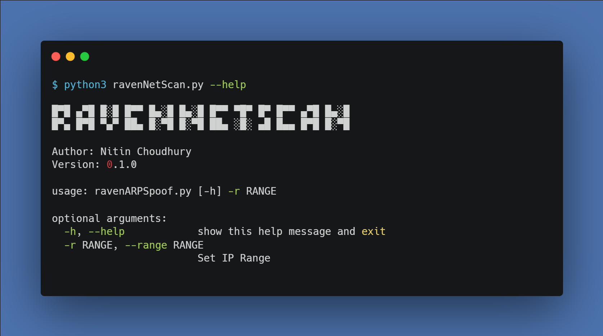
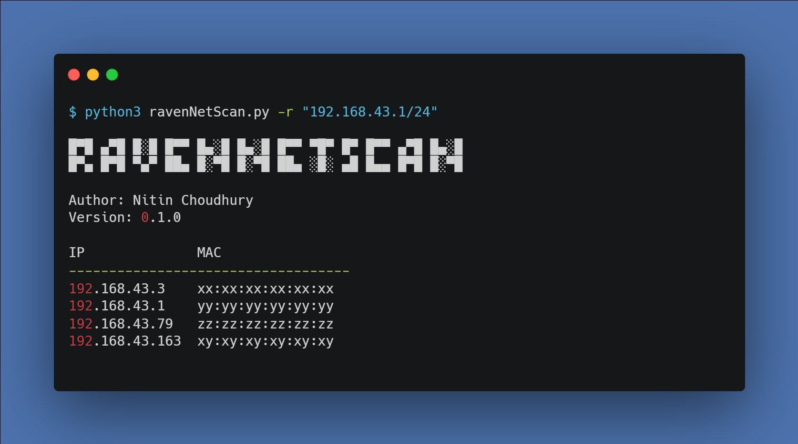

# RavenNetScan
RavenNetScan is a tool that scans for hosts in the same network and returns their IP Addresses and MAC Addresses.

# Set-Up

* Install the requirements
```
pip3 install -r requirements.txt
```

# Use

* Help Menu
```
python3 ravenNetScan.py --help
```


* Run against IP range
```
python3 ravenNetScan.py -r "<ip-range>"
```
